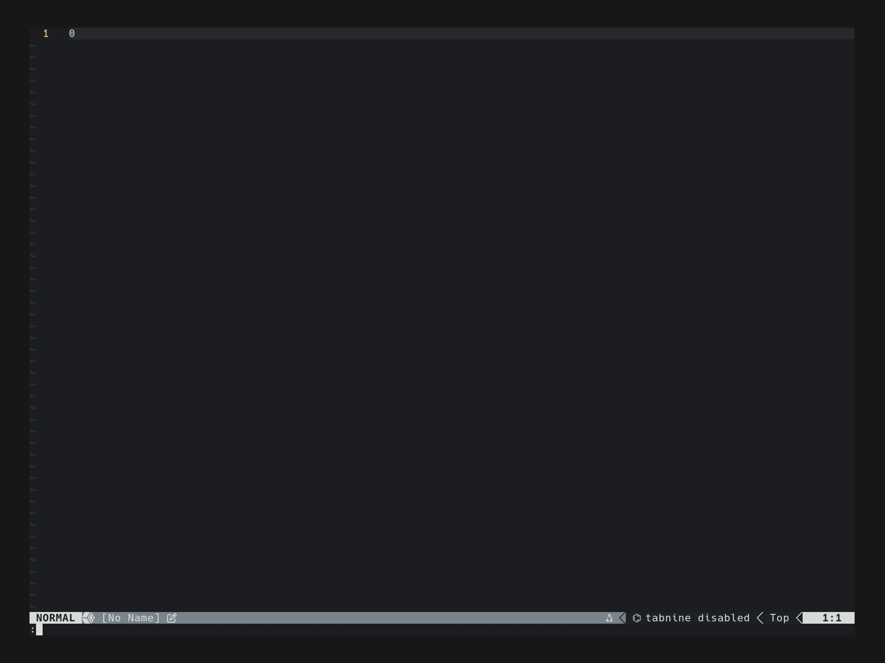

# ddu-source-k8s

* This plugin use `kubectl` to make DDU list.
* The items shown is decorated by [Nerd Fonts](https://www.nerdfonts.com/) and [highlight groups](https://neovim.io/doc/user/syntax.html#hl-ColorColumn).
* Additionally, some detail information of a K8S resource is shown by [ddu-item-attribute-info](https://github.com/Shougo/ddu.vim/blob/main/doc/ddu.txt).

See [ddu-source-k8s.txt](doc/ddu-source-k8s.txt) for full documentation.

## Demo



## Requirements

* [NVIM v0.10+](https://neovim.io/)
* [denops.vim](https://github.com/vim-denops/denops.vim), [ddu.vim](https://github.com/Shougo/ddu.vim), [ddu-ui-ff](https://github.com/Shougo/ddu-ui-ff)
* [Nerd Fonts](https://www.nerdfonts.com/)
* Your favorite [ddu-matcher-filter](https://github.com/topics/ddu-filter)
* [kubectl](https://kubernetes.io/docs/reference/kubectl/)

## Installation

* [Lazy.nvim](https://github.com/folke/lazy.nvim)
    ```lua
    { 'mikelue/ddu-source-k8s' },
    ```
* [vim-plug](https://github.com/junegunn/vim-plug)
    ```vim
    Plug 'mikelue/ddu-source-k8s'
    ```
* [Packer.nvim](https://github.com/wbthomason/packer.nvim)
    ```lua
    use 'mikelue/ddu-source-k8s'
    ```
* [Paq-nvim](https://github.com/savq/paq-nvim)
    ```lua
    require('paq')({ 'mikelue/ddu-source-k8s' })
    ```

## Supported K8S resources

```
configmap, context, cronjob, daemonset, deployment, endpointslice,
job, namespace, node, persistentvolume, persistentvolumeclaim,
pod, replicaset, secret, service, statefulset
```

## NVIM Command

`:DduK8s [-ns=] [-c=] [-l=] [-d] {kind}`

See [ddu-source-k8s.txt](doc/ddu-source-k8s.txt) for reference of `:DduK8s`.

## Example(DDU startup)

```lua
local podOptions = {
    name = 'k8s_pod',
    sources = {
        {
            name = 'k8s_pod',
        },
    },

    kindOptions = {
        k8s_pod = {
            defaultAction = 'open'
        }
    }
}

vim.fn['ddu#start'](podOptions)
```
